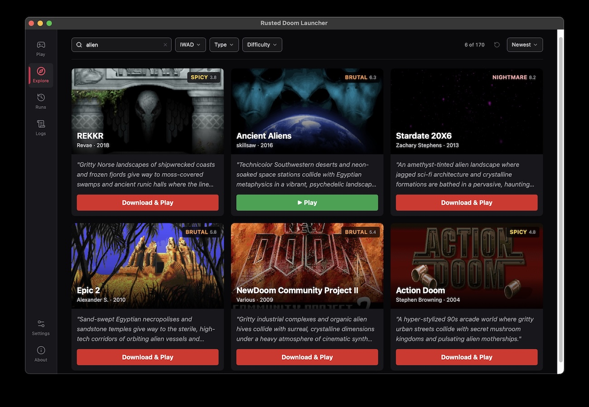

# Rusted Doom Launcher

A modern open-source launcher for classic Doom WADs and mods.
Browse community-made maps and episodes, then install and launch them with a single click—essentially bringing the Steam experience to Doom.

I got inspired by [Doom & Retro FPS Mods](https://www.facebook.com/groups/495775970100553/) FaceBook group and gameplays of modern maps - the scence is alive and well! For now, the library consists of the top maps from [Cacowards](https://www.doomworld.com/cacowards/). I am open to expand it.

It is currently in alpha. I build it for myself, but sharing it so others may enjoys as well.
There are similar apps, notably [Doom Launcher](https://github.com/nstlaurent/DoomLauncher), but they are either Windows-only or lack features I wanted.

I use macOS (Apple Silicon) and created this tool specifically for it.
There are no builds yet for other systems, but porting should be straightforward. If you want to make it runnable on Windows or Linux, I would be happy to add it to the repo.



## Requirements

- [GZDoom](https://github.com/ZDoom/gzdoom/) - Doom source port
  - works also with newer [UZDoom](https://github.com/UZDoom/UZDoom/), there is some [drama about the GZDoom-UZDoom split](https://arstechnica.com/gaming/2025/10/civil-war-gzdoom-fan-developers-split-off-over-use-of-chatgpt-generated-code/)
- `doom.wad` and `doom2.wad` - Doom game data from [GOG.com](https://www.gog.com/en/game/doom_doom_ii) or Steam
  - The app can extract IWADs directly from GOG installers using [innoextract](https://constexpr.org/innoextract/) (`brew install innoextract`)

## Install

### macOS

The easiest way is to use [Homebrew](https://brew.sh/) via my tap [stared/doom](https://github.com/stared/homebrew-doom/).

```bash
brew install --cask stared/doom/rusted-doom-launcher
```

Alternatively, download a binary from [releases](https://github.com/stared/rusted-doom-launcher/releases). Since it is unsigned open-source software, you must remove the quarantine attribute before running (otherwise macOS will report it as damaged):

```bash
xattr -cr /Applications/Rusted\ Doom\ Launcher.app
```

You also need a Doom engine. Install it manually or via Homebrew:

```bash
brew install --cask gzdoom
# or newer:
brew install --cask stared/doom/uzdoom
```

### Linux and Windows

Not yet!

Contributions are welcome if you can make it work on these systems.

## Features

- **Visual Browsing:** Explore WADs with embedded YouTube previews
- **Instant Action:** One-click launch with UZDoom/GZDoom
- **Mod Manager:** Download new WADs directly within the app
- **Stat Tracking:** Track your play stats per level

## Development

To build from source, you need [pnpm](https://pnpm.io/) and [Rust](https://rustup.rs/).

Install dependencies and run:

```bash
pnpm install
pnpm tauri dev
```

Build for production:

```bash
pnpm tauri build
```

### AI-Assisted Debugging (MCP)

The app includes [tauri-plugin-mcp-bridge](https://github.com/hypothesi/mcp-server-tauri) for AI debugging via Claude Code.

```bash
# Install MCP server for Claude Code
npx -y install-mcp @hypothesi/tauri-mcp-server --client claude-code
```

With the app running (`pnpm tauri dev`), Claude Code can take screenshots, click elements, execute JS, and inspect the DOM.

## Tech

- [Tauri 2](https://v2.tauri.app/) (it's in Rust, hence the project name)
- [Vue 3](https://vuejs.org/) in TypeScript
- Python scripts for some processing
- Claude Code and Gemini for vibe coding

## Author

[Piotr Migdal](https://p.migdal.pl)

## License

MIT
