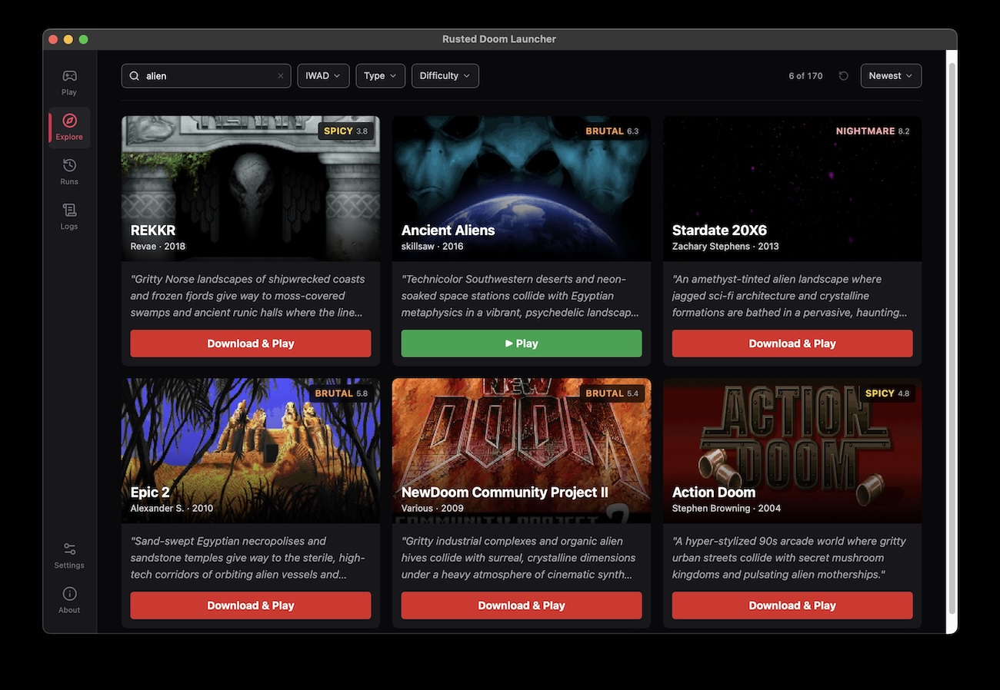

# Rusted Doom Launcher

A modern open-source launcher for classic Doom WADs and mods.
Browse community-made maps and episodes, then install and launch them with a single click - essentially bringing the Steam experience to Doom.



## Features

- **Browse the catalog:** Search by mood, type, and difficulty
- **[Cacowards](https://www.doomworld.com/cacowards/) included:** Yearly awards for the best Doom maps, megawads, and mods
- **One-click play:** Download and launch with a modern source port (GZDoom or UZDoom)
- **Stack gameplay mods:** Run mods on top of any base game or WAD
- **Bring your own:** Drop in a WAD you already have
- **Track your runs:** Per-level stats and session history
- **Plays the classics:** Doom, Doom II, Final Doom, Heretic, Hexen, Freedoom
- **Auto-extracts game files:** Pulls IWADs directly from GOG installers
- **Cross-system:** macOS (Apple Silicon and Intel), Windows, Linux (dev)

If you want or need other features, open [a feature request](https://github.com/stared/rusted-doom-launcher/issues) describing what you would like to see, or even better - open [a pull request](https://github.com/stared/rusted-doom-launcher/pulls).

I am also open to expanding the maps, megawads and mod library - if you want to add your favorite WAD (or your WAD!), feel free to open a PR.

## Motivation

The scene is alive and well - see [newest releases at Doomworld](https://www.doomworld.com/forum/4-map-releases-development/).
I got inspired by gameplays shared at [Doom & Retro FPS Mods](https://www.facebook.com/groups/495775970100553/) Facebook group.

I built it for myself, so I can run it on my Apple Silicon Macbook - but sharing it so others may enjoy it as well.
While there are similar apps, notably [Doom Launcher](https://github.com/nstlaurent/DoomLauncher), they are either Windows-only or lack features I wanted.

## Requirements

- [GZDoom](https://github.com/ZDoom/gzdoom/) - Doom source port
  - works also with the newer [UZDoom](https://github.com/UZDoom/UZDoom/)
- `doom.wad` and `doom2.wad` - Doom game data from [GOG.com](https://www.gog.com/en/game/doom_doom_ii) or Steam
  - The app can extract IWADs directly from GOG installers using [innoextract](https://constexpr.org/innoextract/) (`brew install innoextract`)

## Install

### macOS

The easiest way is to use [Homebrew](https://brew.sh/) via my tap [stared/doom](https://github.com/stared/homebrew-doom/).

```bash
brew install --cask stared/doom/rusted-doom-launcher
```

Alternatively, download a binary from [releases](https://github.com/stared/rusted-doom-launcher/releases). Since it is unsigned open-source software, you must remove the quarantine attribute before running (otherwise macOS will report it as damaged):

```bash
xattr -cr /Applications/Rusted\ Doom\ Launcher.app
```

You also need a Doom engine. Install it manually or via Homebrew:

```bash
brew install --cask gzdoom
# or newer:
brew install --cask stared/doom/uzdoom
```

### Windows

See Windows binary in [releases](https://github.com/stared/rusted-doom-launcher/releases).

### Linux

No pre-built binary yet. You can run it from source — see [Building from source](#building-from-source) below.

### First run

When you open the app for the first time, it will prompt you to locate your Doom engine (GZDoom/UZDoom) and your base game WADs (`doom.wad` / `doom2.wad`). If you have GOG offline installers, the app can extract the game files for you automatically (requires `innoextract`).

## Building from source

To build from source, you need [pnpm](https://pnpm.io/) and [Rust](https://rustup.rs/).

Install dependencies and run:

```bash
pnpm install
pnpm tauri dev
```

Build for production:

```bash
pnpm tauri build
```

### AI-Assisted Debugging (MCP)

The app includes [tauri-plugin-mcp-bridge](https://github.com/hypothesi/mcp-server-tauri) for AI debugging via Claude Code.

```bash
# Install MCP server for Claude Code
npx -y install-mcp @hypothesi/tauri-mcp-server --client claude-code
```

With the app running (`pnpm tauri dev`), Claude Code can take screenshots, click elements, execute JS, and inspect the DOM.

## Tech

- [Tauri 2](https://v2.tauri.app/) (it's in Rust, hence the project name)
- [Vue 3](https://vuejs.org/) in TypeScript
- Python scripts for some processing
- Claude Code and Gemini for vibe coding

## Author

[Piotr Migdał](https://p.migdal.pl) and contributors

## License

MIT
